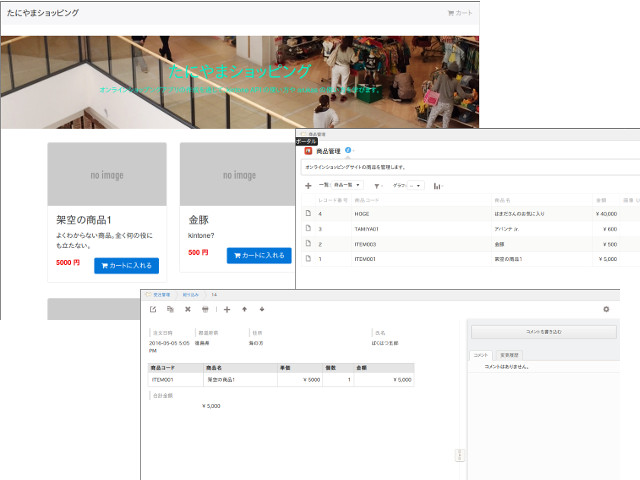

# オンラインショッピングハンズオンプロトタイプ

## 目的
kintone をバックエンドに利用することで手軽にアプリが作れること、arukas を使うことで手軽にアプリをデプロイできることを学ぶ。

## 構成
* kintone アプリは `商品管理` と `受注管理` の二つで構成されています
* アプリは Node.js 6.0 + Express 4 を利用しています
  - 商品の情報を `商品管理` アプリから取得し、注文を `受注管理` に追加します
* アプリを Docker イメージ化する [Dokcerfile](Dockerfile) 付
  - それを DockerHub にプッシュする [circle.yml](circle.yml) 付
* GitHub へコミットすれば、arukas にすぐにデプロイできるようになっています
  - Docker 環境はローカルには必要ありません
  - arukas へのデプロイは手動です
